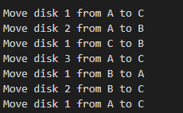

# Tower_of_Hanoi

## Introduction:

The Tower of Hanoi (also called the Tower of Brahma or Lucas' Tower and sometimes pluralized as Towers) is a mathematical game or puzzle. It consists of three rods and a number of disks of different sizes, which can slide onto any rod. The puzzle starts with the disks in a neat stack in ascending order of size on one rod, the smallest at the top, thus making a conical shape.

## Rules:

The objective of the puzzle is to move the entire stack to another rod, obeying the following simple rules:

    - Only one disk can be moved at a time.
    
    - Each move consists of taking the upper disk from one of the stacks and placing it on top of another stack or on an empty rod.
    
    - No larger disk may be placed on top of a smaller disk.

With 3 disks, the puzzle can be solved in 7 moves. The minimal number of moves required to solve a Tower of Hanoi puzzle is 2n − 1, where n is the number of disks. 

## Example of TOH problem for 3 disks:

When we run a following code of TOH problem, we get following result:

